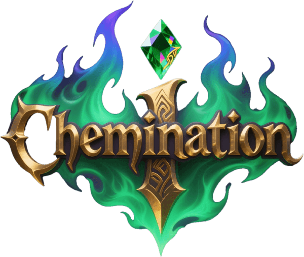
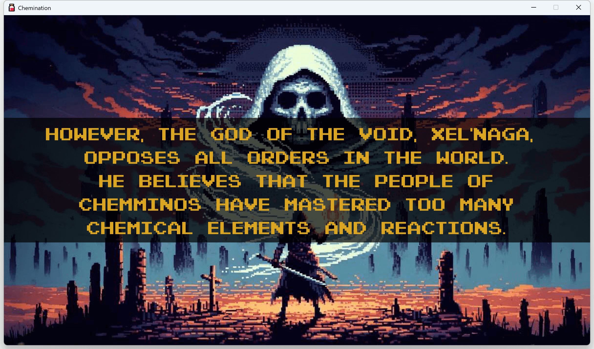
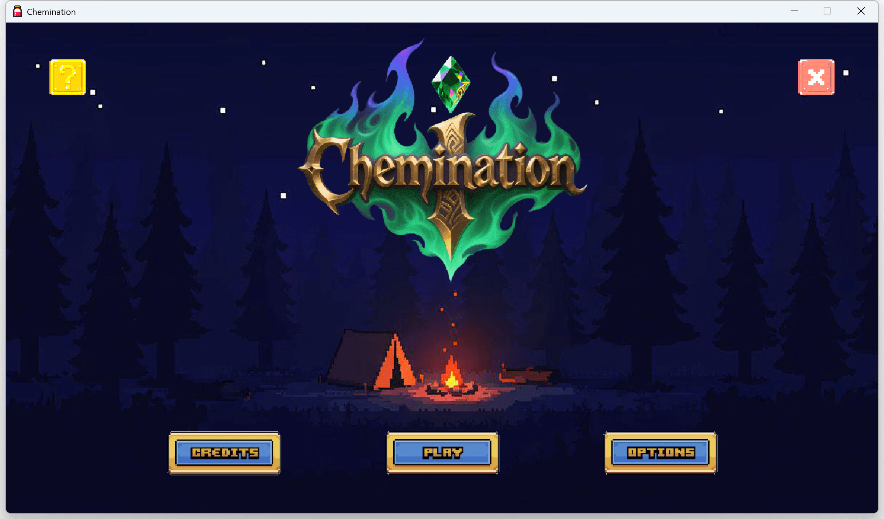
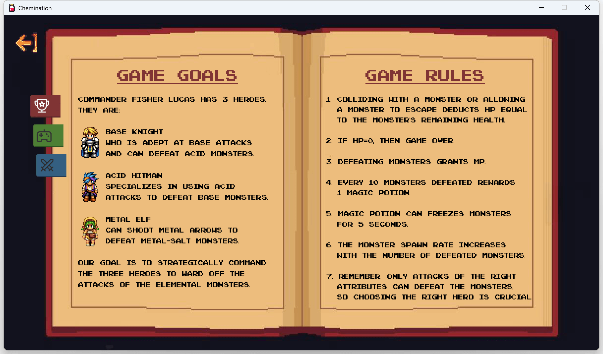
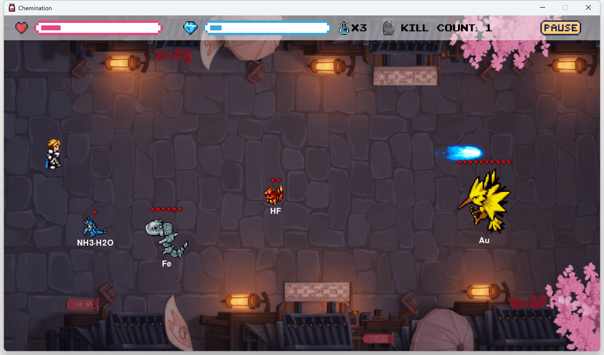
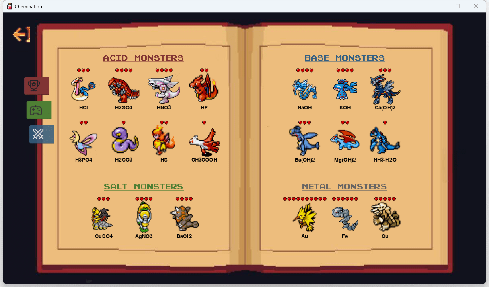
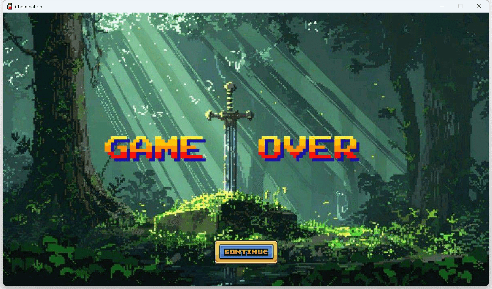

<div align="center">

<h1>Chemination</h1>
</div>

An educational chemistry game built with Python and Pygame where players strategically command heroes to defend against elemental monsters. 

> Chemination = **Chem**istry + Elim**ination**, which originated from my Y10 Chemistry Course Project.

## Description

Chemination is an educational game that helps players learn chemistry concepts through gameplay. Players command three heroes - Base Knight, Acid Hitman, and Metal Elf - to defeat elemental monsters that match their attack attributes.

## Screen Shots

|              Intro              |                Main Menu                |             Help              |
|:-------------------------------:|:---------------------------------------:|:-----------------------------:|
|  |  |  |

|              Battle              |               Monsters                |              Game Over              |
|:--------------------------------:|:-------------------------------------:|:-----------------------------------:|
|  |  |   |

## Features

- Pixel-art style visuals
- Easy to learn, hard to master
- Command three unique heroes: Base Knight, Acid Hitman, and Metal Elf
- Over 20 elemental monsters across acids, bases, salts, and metals
- Progressive difficulty with increasing monster spawn rates
- Strategic gameplay requiring correct hero-attribute matching
- HP system with collision and escape penalties
- MP system for defeating monsters
- Magic potion system
- Particle effects for killing monsters and taking damage
- Background music with toggle controls

## Todo

- [ ] Optimize game balance (In Progress)
- [ ] Change the battlefield scene as the game progresses (In Progress)
- [ ] Add a tutorial mode (In Progress)
- [ ] Add items such as alcohol lamps and catalysts
- [ ] Add more monsters and reaction types

## Installation

1. Clone or download [this repository](https://github.com/fisheryv/chemination)
   ```
   git clone https://github.com/fisheryv/chemination.git
   cd chemination
   ```
2. Install the required dependencies:
   ```
   pip install -r requirements.txt
   ```
3. Run the game:
   ```
   python main.py
   ```

## How to Play

1. Command your heroes to defeat the elemental monsters:
   - **Base Knight** (blue) defeats Acid Monsters
   - **Acid Hitman** (red) defeats Base Monsters
   - **Metal Elf** (green) defeats Metal-Salt Monsters
2. Use controls to switch heroes and attack:
   - Keyboard: `Arrow keys` or `WASD` to move/switch, `Space` to shoot, `X` for freeze skill
   - Mouse: `Left click` to shoot, `Right click` to switch heroes, `X` key for freeze skill
3. Game rules:
   - Colliding with a monster or allowing a monster to escape deducts HP equal to the monster's remaining health
   - If HP=0, then game over
   - Defeating monsters grants MP
   - Every 10 monsters defeated rewards 1 magic potion (freeze skill)
   - Monster spawn rate increases with the number of defeated monsters
   - Only attacks of the right attributes can defeat the monsters, so choosing the right hero is crucial
4. Pause and exit:
   - Press `Space` or `Right click` to skip intro
   - Pause the game at any time by clicking the `pause` button in the upper-right corner of battle scene
   - Click the Main Menu close button or the window close button to exit the game

## Project Structure

The project has been modularized for better maintainability:

```
chemination/
├── main.py          # Main entry point
├── src/             # Source code directory
│   ├── __init__.py
│   ├── config/      # Configuration and settings
│   │   ├── __init__.py
│   │   └── settings.py
│   ├── data/        # Game data (chemical databases)
│   │   ├── __init__.py
│   │   └── chemicals.py
│   ├── entities/    # Game entities (player, ui blocks etc.)
│   │   ├── __init__.py
│   │   ├── bullet.py
│   │   ├── button.py
│   │   ├── enemy.py
│   │   ├── hero.py
│   │   ├── processbar.py
│   │   └── switcher.py
│   ├── utils/       # Utility modules (effects, tools)
│   │   ├── __init__.py
│   │   ├── effects.py
│   │   └── tools.py
│   └── game/        # Main game logic
│       ├── __init__.py
│       ├── battle.py
│       ├── credits.py
│       ├── game_over.py
│       ├── help.py
│       ├── main_menu.py
│       ├── options.py
│       ├── scene.py
│       ├── story.py
│       └── game.py
├── assets/          # Game assets
│   ├── audios/      # Audio files
│   ├── fonts/       # Font files
│   └── images/      # Image assets
├── requirements.txt # Python dependencies
└── README.md        # This file
```

## Requirements

- Python 3.x
- Pygame 2.6.1

## Packaging

**PyInstaller** 

```bash
pyinstaller main.spec
```

**Nuitka**

```bash
nuitka --standalone --onefile \
  --include-data-files=./icon.ico=icon.ico \
  --include-data-dir=./assets=assets \
  --output-dir=out \
  --windows-icon-from-ico=icon.ico \
  --windows-console-mode=disable \
  --remove-output \
  main.py
```

## Recent Improvements

- Enhanced error handling with fallback graphics for missing assets
- Improved code documentation and structure
- Better resource management
- Modularized code for easier maintenance
- Enhanced game mechanics and skill system

## Credits

- Game developed in collaboration with **Lucas Gao**
- The monster assets are derived from the "Pokémon"
- The hero assets are derived from the "Grinsia"
- Other visual assets were obtained from online sources or generated by AI
- All music tracks are sourced from the internet

## License

This project is open source and available under the MIT License.